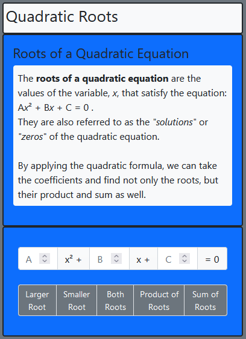
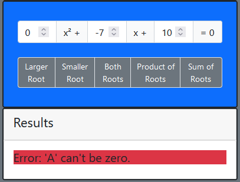
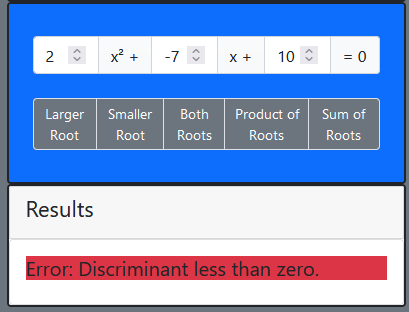

# Largest Quadratic Root

Simple program to find the larger of the two roots of the following quadratic equation, provided it has any roots: A(x^2) + B(x) + C = 0
The user will input the values for A, B and C; the program will run a subroutine based on the Java version from Eck (2019).

## Table of contents

- [Overview](#overview)
  - [The challenge](#the-challenge)
  - [Screenshot](#screenshot)
- [My process](#my-process)
  - [Built with](#built-with)
  - [What I learned](#what-i-learned)
  - [Continued development](#continued-development)
  - [Useful resources](#useful-resources)
- [Author](#author)

## Overview

Initially, the project was just to find the larger of the two roots, if they exist; however, I decided to push it a little bit further and flesh out the functionality. Since we were already providing the coefficients, we might as well maximize on the possible outputs. Which has allowed the project to evolve to this point.

### The challenge

Users should be able to:
- Specify values for A, B and C
- Choose between 'Large Root', 'Small Root', 'Both', 'Product' and 'Sum'
- Receive a 'real number' root
  - Should the root be a complex number or a divide by zero error occurs
    - An error message will be displayed in the results section

### Screenshot

## My process

I first started with converting the Java source code to a TypeScript format, and then I followed suit with creating the files for the other functions. Once I had the math portion completed, it was simple enough to build the HTML elements with BootStrap 5. After that, it was just building the event listeners and finding a way to display the error message to the users rather than the console.

### Built with

- HTML5
- BootStrap 5
- TypeScript

### What I learned

This was a great refresher on TypeScript and quadratic equations. The most important thing I learned was how to use the TypeScript compiler to separate the functions into modules to reduce clutter on the main file. 

### Continued development

Since I fleshed out this page pretty well; I don't really have any next steps planned for it.

The only future plans are to flesh out the navbar if I decide to incorporate this project into a portfolio.

### Useful resources

- [CueMath | Roots of Quadratic Equations](https://www.cuemath.com/algebra/roots-of-quadratic-equation/) - It's been a little while since I did quadratic equations. This page helped me ensure that the functions were working properly
- [BootStrap 5 | Documentation](https://getbootstrap.com/docs/5.0/getting-started/introduction/) - This is always such a big help when setting up my pages. 

## Author

- Website - [GitHub/ravenloue](https://github.com/ravenloue)
- LinkedIn - [Brandie Mallard](https://www.linkedin.com/in/brandie-mallard-0554aa219/)
- Twitter - [@ravenloue](https://www.twitter.com/ravenloue)